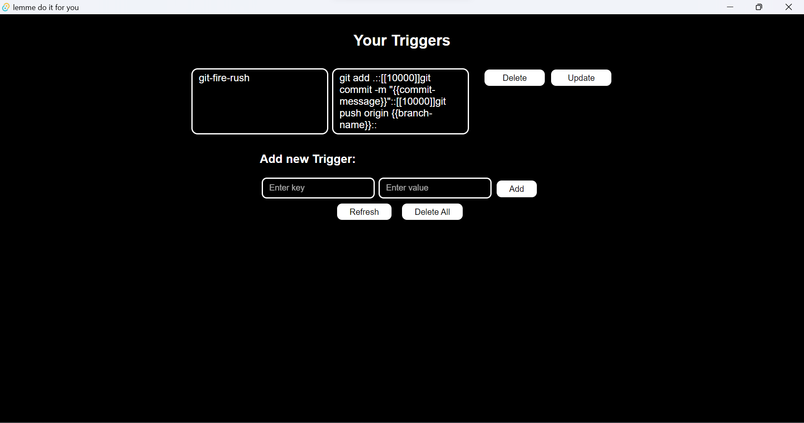

# Tauri Trigger App - Automate with Style :rocket:

Welcome to the Tauri Trigger App! 🚀 This nifty little tool empowers you to automate tasks in your terminal with a touch of flair. Whether you're tired of the repetitive git-push-grab-coffee dance, or you simply want to have a bit of fun with your automation, this app has got your back.

## Features

- Set Custom Triggers: Need some inspiration? We've got you covered! Or, unleash your creativity and define triggers that match your style! Use the `::` symbol to simulate pressing the ENTER key wherever you need it. 👉🕹️
- Time Delays: Need a breather? Use `[[milliseconds]]` to insert a pause between actions. Time for a sip of coffee, perhaps? ☕️
- User-Prompted Variables: Curly braces `{{}}` to the rescue! Insert variables that prompt you for values, like `{{commit-message}}` or `{{branch-name}}`. Customize on the fly! Need some runtime data? We're here for you! 🤖📊
- Fire Mode : Ever wanted to add a dramatic touch to your workflow? In case of fire, don't just `git add`, `git commit`, and `git push`—run for the extinguisher! 🔥

## Getting Started

1. **Clone the Repository**: Start by cloning this repository to your local machine.

```bash
git clone https://github.com/harsh11101/lemme-do-it-for-you.git
```

2. **Install Dependencies**: Navigate to the project directory and install the required dependencies.

```bash
cd lemme-do-it-for-you
npm install
```

3. **Run the App**: Launch the Tauri app and bring your automation dreams to life!

```bash
npm tauri dev
```

## Screenshots



## Examples

### Automating Git Push

Let's say you want to automate the process of pushing to a Git repository. Here's how you can set it up:

1. Trigger: `git-push`
2. Value: `git push origin {{branch-name}}`

Now, whenever you use the `git-push` trigger, the app will prompt you for the branch name and perform a push for you!

### A Dramatic Git Push (Fire Mode)

You know, just in case of fire:

1. Trigger: `fire-git-push`
2. Value:
   1. `git add .`
   2. `git commit -m "{{commit-message}}"`
   3. `git push origin {{branch-name}}`
   4. `run for your life`

Remember, safety first! 🔥

## Contribution

Found a bug? Want to add a witty feature? Contributions are welcome! Just fork this repository, make your changes, and submit a pull request. Let's make automation fun together! 🎉


---

Happy automating, and remember: With great automation comes great responsibility! 😉🤖🔥